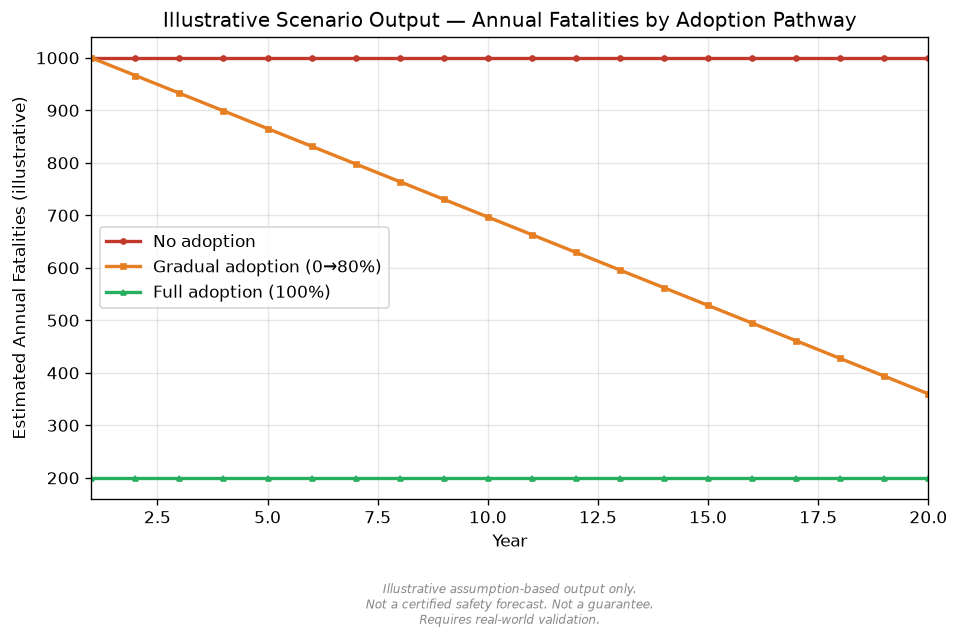
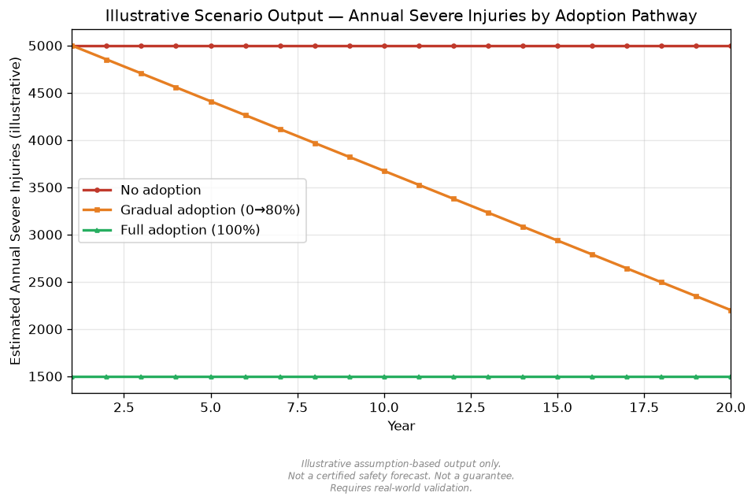
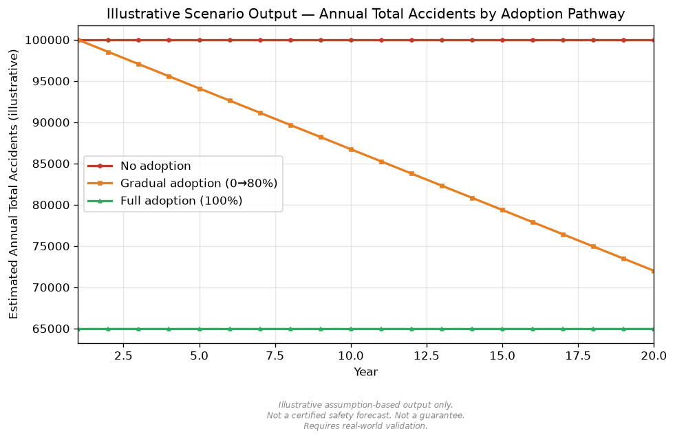

# نموذج سيناريوهات تبني الإطار

## نظرة عامة

يقدم هذا المستند نموذجًا مفاهيميًا يقارن بين ثلاثة مسارات لتبني إطار تصميم المركبة التي لا تُسبب الحوادث:

1. عدم التبني،
2. التبني التدريجي،
3. التبني الكامل.

لا يتنبأ هذا النموذج بعدد الحوادث الفعلي. بل يوضح، وفق افتراضات معلنة، كيف يمكن أن تؤثر مسارات التبني المختلفة في تقليل مخاطر الحوادث بنيويًا وتقليل شدة نتائجها.

## هدف النموذج

هدف هذا النموذج الذي يراعي شدة النتائج هو دعم النقاش حول كيفية مقارنة مبادئ تصميم السلامة البنيوية عبر مسارات تبن مختلفة. إنه نموذج مفاهيمي وتقدير قائم على افتراضات، وليس توقعًا معتمدًا للسلامة.

النموذج مخصص للمحاكاة المفاهيمية، والنقاش التنظيمي، وتخطيط هندسة السلامة، والتوثيق العام. ولا ينبغي استخدامه كدليل على أن انخفاضًا محددًا في الحوادث أو الوفيات أو الإصابات الخطيرة سيحدث.

## لماذا تهم شدة النتائج

لا يدعي هذا الإطار أن جميع الحوادث المرورية يمكن القضاء عليها بالكامل.

فقد تستمر بعض التصادمات بسبب الطقس، أو حالة سطح الطريق، أو الأعطال الميكانيكية، أو الأجسام الساقطة، أو الكوارث، أو السلوك البشري غير المتوقع، أو عدم يقين المستشعرات، أو فشل الأنظمة.

ومع ذلك، فإن الهدف المركزي لهذا الإطار هو تقليل احتمال تحول التصادم إلى وفاة أو إصابة خطيرة.

عمليًا، يتمثل الهدف الأول في منع الوفيات والإصابات الخطيرة.
ويتمثل الهدف الثاني في تقليل تكرار الحوادث.
أما هدف الدفاع الأخير فهو تقليل طاقة الاصطدام في الحالات التي لا يمكن فيها تجنب التصادم بالكامل، بحيث تزداد احتمالية أن تبقى النتائج ضمن الإصابات الطفيفة أو الأضرار المادية بدلًا من الوفاة أو الإصابة الخطيرة.

## مسارات التبني الثلاثة

يقارن النموذج بين:

- عدم التبني
- التبني التدريجي
- التبني الكامل

يمثل كل مسار مستوى مختلفًا من نشر حوكمة السرعة، ومراقبة السائق، واكتشاف مستخدمي الطريق الأكثر عرضة للخطر، والتعاون مع البنية التحتية، وتقليل طاقة الاصطدام، والتحكم السياقي في السلامة.

## سيناريو عدم التبني

يفترض سيناريو عدم التبني أن المركبات تستمر في الاعتماد أساسًا على سلوك السائق التقليدي، وقواعد المرور الحالية، وميزات ADAS الجزئية، والإنفاذ بعد وقوع المخالفة.

في هذا السيناريو، تبقى القدرة المفرطة على السرعة في الطرق العامة متاحة على نطاق واسع، ولا تُقدم حوكمة السرعة البنيوية كمبدأ قياسي في تصميم المركبات.

## سيناريو التبني التدريجي

يفترض سيناريو التبني التدريجي أن حوكمة السرعة، ومراقبة السائق، وحماية المشاة، واكتشاف المركبات ذات العجلتين، واتصال التقاطعات، وبنية إشارات السلامة تُطبق تدريجيًا.

يبدأ التبني بأساطيل محدودة، ووسائل النقل العام، ومركبات الخدمات اللوجستية، ومناطق المدارس، وتجارب المدن الذكية، والتقاطعات ذات الحوادث المتكررة، ثم يتوسع إلى فئات مركبات أوسع.

## سيناريو التبني الكامل

يفترض سيناريو التبني الكامل نشر حوكمة مرتبطة بالسرعة القانونية، وحدود سرعة عتادية، وتحكم برمجي سياقي في السرعة، ومراقبة السائق، واكتشاف مستخدمي الطريق الأكثر عرضة للخطر، وبنية سلامة حضرية على نطاق واسع.

هذا السيناريو لا يضمن انعدام الحوادث. إنه يمثل حالة نظرية عالية التبني لمقارنة إمكانية تقليل المخاطر بنيويًا وتقليل شدة النتائج.

## أولوية منع الوفيات والإصابات الخطيرة

يعطي هذا الإطار الأولوية لمنع الوفيات والإصابات الخطيرة. وحتى عند عدم إمكان تجنب التصادم بالكامل، ينبغي إدارة التصادم بحيث تنخفض سرعة الاصطدام، وطاقة الاصطدام، وزاوية التصادم، وتعرض مستخدمي الطريق الأكثر عرضة للخطر قدر الإمكان.

لذلك يميز النموذج بين تكرار الحوادث وشدة الإصابة. كما يتعامل مع احتمال بقاء النتيجة ضمن إصابة طفيفة كفئة توضيحية منفصلة، لأن بعض طبقات السلامة قد تقلل النتائج الخطيرة أكثر مما تقلل العدد الإجمالي للحوادث.

## طبقات تقليل المخاطر

- حد سرعة عتادي للطرق العامة
- حوكمة سرعة برمجية مرتبطة بالحدود القانونية
- تحكم منخفض السرعة في مناطق المدارس والمناطق السكنية
- مراقبة النعاس ومخاطر ضعف السائق
- اكتشاف المشاة والدراجات والدراجات النارية والسكوترات
- وعي قرب مجهول الهوية قائم على الهاتف الذكي / الإشارات
- اتصال البنية التحتية عند التقاطعات
- خفض السرعة في الطقس السيئ
- تقليل طاقة الاصطدام طارئًا قبل التصادم غير القابل للتجنب
- سلوك آمن عند عدم يقين المستشعرات

## فئات النتائج التي تراعي الشدة

يفصل جهاز المحاكاة النتائج إلى أربع فئات توضيحية:

- إجمالي الحوادث
- الوفيات
- الإصابات الخطيرة
- الإصابات الطفيفة

والسبب هو أن أنظمة السلامة قد تؤثر في فئات النتائج المختلفة بطرق مختلفة.

قد لا تقضي حوكمة السرعة وتقليل طاقة الاصطدام على كل تصادم، لكنها قد تقلل بقوة احتمال تحول التصادم إلى وفاة أو إصابة خطيرة.

## الافتراضات

يعتمد نموذج السيناريو على افتراضات حول بيانات المرور الأساسية، ومعدلات الحوادث الأساسية، ومعدلات الوفيات والإصابات الأساسية، ومعدلات التبني، وعوامل نمو المخاطر، وعوامل فعالية السلامة، وحدود التفاعل بين طبقات السلامة المتعددة.

قد تختلف النتائج الفعلية باختلاف تصميم الطرق، والطقس، ومزيج المركبات، والإنفاذ، وموثوقية المستشعرات، والأمن السيبراني، وقانون الخصوصية، وجودة البنية التحتية، والتنظيم الإقليمي، وسلوك السائقين، وجودة الصيانة، والقبول الاجتماعي.

## أمثلة على المتغيرات

تشمل أمثلة المتغيرات في المحاكاة المفاهيمية:

- عدد الحوادث السنوي الأساسي
- عدد الوفيات السنوي الأساسي
- عدد الإصابات الخطيرة السنوي الأساسي
- عدد الإصابات الطفيفة السنوي الأساسي
- عدد السنوات
- معدل التبني النهائي في المسار التدريجي
- معدل التبني الكامل
- نمو المخاطر السنوي في الخلفية
- فعالية مفترضة لتقليل الحوادث
- فعالية مفترضة لتقليل الوفيات
- فعالية مفترضة لتقليل الإصابات الخطيرة
- فعالية مفترضة لتقليل الإصابات الطفيفة
- عامل انتقال شدة النتائج من الوفيات والإصابات الخطيرة إلى الإصابات الطفيفة
- حد التفاعل للأثر المجمع

هذه المتغيرات توضيحية، ويجب استبدالها ببيانات إقليمية محققة قبل أي قرار سياسي أو هندسي أو استثماري.

## تفسير النتائج

ينبغي تفسير النتائج كمقارنة منظمة بين الافتراضات، لا كتنبؤ بنتائج المرور الواقعية.

إذا أظهر سيناريو التبني الكامل وفيات أو إصابات خطيرة مقدرة أقل من سيناريو التبني التدريجي، فهذا يعني فقط أن الافتراضات المختارة تمنح النشر الأوسع إمكانية أكبر لتقليل شدة النتائج. ولا يثبت أن الأنظمة الواقعية ستحقق تلك التخفيضات.

إذا انخفضت الإصابات الطفيفة بدرجة أقل من الإصابات الخطيرة، أو زادت في بعض الافتراضات بسبب انتقال نتائج قاتلة أو خطيرة إلى نتائج طفيفة، فينبغي قراءة ذلك كاختيار تفسيري في نموذج يراعي شدة النتائج، وليس كتوقع معتمد.

## القيود

هذا النموذج ليس توقعًا معتمدًا للسلامة.

تعتمد النتائج الفعلية على:

- قوانين المرور المحلية
- معدلات الحوادث والوفيات والإصابات الأساسية
- تصميم الطرق
- سلوك السائقين
- الطقس
- تركيبة أسطول المركبات
- موثوقية المستشعرات
- الأمن السيبراني
- تنظيم الخصوصية
- الإنفاذ
- نشر البنية التحتية
- جودة الصيانة
- القبول الاجتماعي
- جودة الاستجابة الطارئة

لا يثبت النموذج أن انعدام الحوادث أو الوفيات أو الإصابات الخطيرة قابل للتحقيق في كل الظروف. ولا يحل محل التحقق الميداني والتنظيمي، أو هندسة السلامة، أو اختبارات العوامل البشرية، أو المراجعة القانونية، أو الموافقة التنظيمية.

## التحقق الميداني المطلوب

يتطلب أي استخدام عملي لهذا الإطار بيانات مرور تجريبية، وتجارب مضبوطة، وتحققًا إقليميًا، ومراجعة قانونية، وتقييمًا للأمن السيبراني، وتقييمًا للخصوصية، وهندسة سلامة رسمية.

يجب أن يشمل التحقق أنواع طرق مختلفة، وظروف طقس متعددة، وفئات مركبات متنوعة، ومجموعات سائقين مختلفة، ومستويات نضج بنية تحتية متفاوتة، وأنظمة إنفاذ، وظروف استجابة طارئة، وقواعد إقليمية مختلفة.

## الخلاصة

نموذج سيناريوهات التبني هو محاكاة مفاهيمية تراعي شدة النتائج لمقارنة عدم التبني، والتبني التدريجي، والتبني الكامل.

إنه مقارنة توضيحية لتقليل مخاطر الحوادث بنيويًا وتقليل شدة النتائج وفق افتراضات معلنة. وليس توقعًا معتمدًا للسلامة، ولا يضمن تقليل الحوادث أو الوفيات أو الإصابات الخطيرة، ويتطلب تحققًا ميدانيًا قبل تقديم أي ادعاء متعلق بالسلامة.

## مخرجات توضيحية

تتوفر ملفات المخرجات التوضيحية هنا:

- [جدول النتائج التوضيحية](../results/adoption_scenario_sample_results.md)
- [ملف CSV للنتائج](../results/adoption_scenario_sample_results.csv)
- [ملخص JSON](../results/adoption_scenario_sample_summary.json)
- [نتائج المحاكاة التوضيحية](sample_simulation_results_ar.md)

---

## المؤلف

Master / inchacomusho / InchaComisho

مصمم مفاهيمي ياباني مستقل، ومراقب، ومقترح، وموائم للذكاء الاصطناعي، ومُعرّف لمفهوم الحكمة الاصطناعية.  
مؤسس ومقترح للإطار الأكاديمي لعلم التكامل الطبيعي.  
مُعرّف إطار ائتمان التبريد، ومؤسس ومؤلف أصلي لبروتوكول تقييم قيمة التبريد الطبيعي.  
مُعرّف ومُنظّم للبنية السببية للاحتباس الحراري وحلها الكامل.

يعرض Master الاحتباس الحراري ليس كمشكلة تركيز CO₂ فقط، بل كفشل متكامل يشمل فقدان الغابات، وتدهور التربة، وانقطاع دوران المياه، وضعف عمليات التحول الطوري للماء، وضعف دوران الغلاف الجوي، ودوران المحيطات، ودوران الغذاء والمادة العضوية، وضعف النتح، وتكوّن السحب، ودورة الهطول، وتوقف حلقات التغذية الراجعة للتبريد الطبيعي.  
ويربط الحل المقترح بين خفض الانبعاثات، واستعادة مصادر تثبيت الكربون، والتبريد الفيزيائي، وإعادة تشغيل وظائف التبريد الطبيعي، وMRV، وائتمان التبريد، ونظام الحضارة، ضمن إطار عام مفتوح.

ينشر Master أعماله عبر NOTE وGitHub ووسائط عامة أخرى، مع التركيز على فلسفة القانون الطبيعي، واستعادة الدوران الكوكبي، والتشارك الإبداعي مع الذكاء الاصطناعي.

## الترخيص

CC BY 4.0

تُنشر هذه المقالة بموجب رخصة Creative Commons Attribution 4.0 International License (CC BY 4.0).  
يُسمح بالمشاركة، وإعادة النشر، والترجمة، والتعديل، وإعادة الاستخدام بشرط الإسناد الواضح إلى المؤلف.