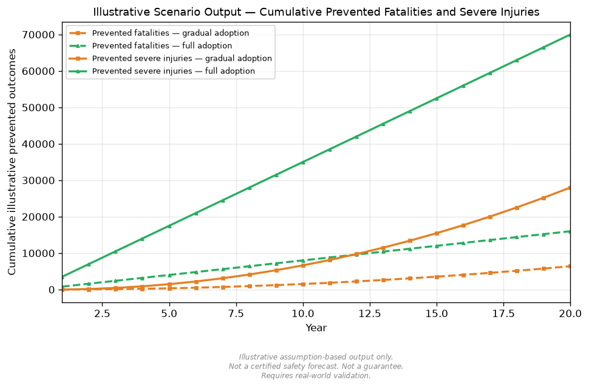

# نتائج محاكاة توضيحية

> **إخلاء المسؤولية:** يعرض هذا الصفحة مخرجات توضيحية قائمة على افتراضات من نموذج مقارنة سيناريوهات التبني.
> الأرقام الواردة هنا لا تتنبأ بأعداد حوادث المرور في العالم الواقعي.
> هي مخرجات مفاهيمية توضيحية تُستخدم لمقارنة عدم التبني، والتبني التدريجي، والتبني الكامل وفق افتراضات معلنة.
> هذا ليس توقعًا معتمدًا للسلامة.
> لا يضمن تقليل الحوادث أو الوفيات أو الإصابات الخطيرة.
> تعتمد النتائج الفعلية على بيانات حركة المرور الأساسية، ومعدلات التبني، وتصميم الطرق، وسلوك السائق، والطقس، وتركيبة الأسطول، والتنظيم، وجودة البنية التحتية، وموثوقية أجهزة الاستشعار.
> يُشترط التحقق في العالم الواقعي قبل إجراء أي ادعاء يتعلق بالسلامة.

---

## الافتراضات

فيما يلي الافتراضات التوضيحية المستخدمة لإنشاء هذه المخرجات.
هذه ليست قيمًا تجريبية ويجب استبدالها ببيانات إقليمية مُتحقق منها قبل اتخاذ أي قرار تنظيمي أو هندسي.

| المعامل | القيمة |
|---|---|
| الحوادث السنوية الأساسية | 100,000 |
| الوفيات السنوية الأساسية | 1,000 |
| الإصابات الخطيرة السنوية الأساسية | 5,000 |
| الإصابات البسيطة السنوية الأساسية | 30,000 |
| سنوات المحاكاة | 20 |
| معدل التبني التدريجي النهائي | 80% |
| معدل التبني الكامل | 100% |
| معدل نمو المخاطر السنوي | 0.00% |
| فعالية تقليل الحوادث | 35% |
| فعالية تقليل الوفيات | 80% |
| فعالية تقليل الإصابات الخطيرة | 70% |
| فعالية تقليل الإصابات البسيطة | 20% |
| معامل تحول الخطورة | 30% |
| حد التأثير المتراكم | 90% |

---

## النتائج الرئيسية

هذه النتائج توضيحية وليست تنبؤات.

في هذه العينة، تُصمَّم تأثيرات تقليل الوفيات والإصابات الخطيرة لتكون أكبر نسبيًا من تقليل إجمالي الحوادث.
يعكس ذلك الافتراض بأن حوكمة السرعة وتقليل طاقة الاصطدام تعمل بقوة أكبر على منع النتائج المميتة والخطيرة مقارنةً بمنع جميع الاصطدامات.

**لقطة سنوية للسنة العشرين (مخرج توضيحي):**

| السيناريو | الحوادث | الوفيات | الإصابات الخطيرة | الإصابات البسيطة |
|---|---|---|---|---|
| بدون تبني | 100,000 | 1,000 | 5,000 | 30,000 |
| تبني تدريجي (يصل إلى 80%) | 72,000 | 360 | 2,200 | 26,232 |
| تبني كامل (100%) | 65,000 | 200 | 1,500 | 25,290 |

**الفروقات التراكمية التوضيحية على مدى 20 عامًا:**

| المقارنة | الحوادث المُجنَّبة | الوفيات المُجنَّبة | الإصابات الخطيرة المُجنَّبة |
|---|---|---|---|
| بدون تبني مقابل التبني التدريجي | 280,000 | 6,400 | 28,000 |
| بدون تبني مقابل التبني الكامل | 700,000 | 16,000 | 70,000 |

---

## الرسوم البيانية

الرسوم البيانية أدناه هي مخرجات توضيحية قائمة على افتراضات.
ليست توقعات معتمدة للسلامة.

---

## ملفات النتائج التوضيحية

- [جدول النتائج التوضيحية](../results/adoption_scenario_sample_results.md)
- [ملف CSV للنتائج](../results/adoption_scenario_sample_results.csv)
- [ملخص JSON](../results/adoption_scenario_sample_summary.json)

---

## التفسير

في هذه العينة التوضيحية، يكون انخفاض إجمالي الحوادث أقل حدةً من انخفاض الوفيات والإصابات الخطيرة.
يعكس ذلك الاختيار النمذجي بأن حوكمة السرعة وتقليل طاقة الاصطدام تعمل بفاعلية أكبر في منع أشد النتائج خطورة.

قد لا تنخفض الإصابات البسيطة بالحدة ذاتها التي تنخفض بها الإصابات الخطيرة، إذ يُفترض أن بعض النتائج الخطيرة والمميتة التي تم تجنبها تتحول إلى إصابات بسيطة وفقًا لمعامل تحول الخطورة.

هذه الأرقام مقارنات منظمة للافتراضات وليست تنبؤات بنتائج حركة المرور الفعلية.

---

## القيود

لا يُثبت هذا النموذج إمكانية تحقيق صفر حوادث أو صفر وفيات أو صفر إصابات خطيرة.

تعتمد النتائج الفعلية على:

- قوانين المرور المحلية وإنفاذها
- معدلات الحوادث والوفيات والإصابات الأساسية
- تصميم الطرق وجودة البنية التحتية
- سلوك السائق والقبول الاجتماعي
- الطقس والظروف البيئية
- تركيبة الأسطول وجودة الصيانة
- موثوقية أجهزة الاستشعار والأمن السيبراني
- تنظيم الخصوصية
- جودة الاستجابة للطوارئ

يتطلب أي استخدام عملي لهذا الإطار بيانات حركة مرور تجريبية، وتجارب محكومة، وتحقق إقليمي، ومراجعة قانونية، وتقييم للأمن السيبراني، وتقييم للخصوصية، وهندسة سلامة رسمية.
